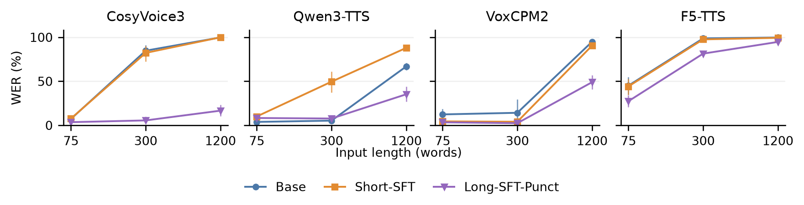
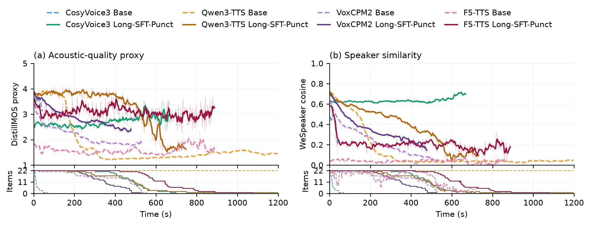

# Balalaika-longform

Code and review artifacts for the Balalaika-longform long-form Russian TTS study.

The study asks whether adapting a TTS model on continuous recordings helps it finish long passages. The dataset provides long recordings and matched short-window training views. The experiments compare these views in CosyVoice3, Qwen3-TTS, VoxCPM2, and F5-TTS. The results support improvements for the autoregressive systems under the measured conditions; F5-TTS remains poor on long passages.

**Start here:** [inspect the main results](artifacts/published50/report/main_b4.md), or regenerate the tables and figures below.

## Reproduce the reported results on CPU

Use Python 3.11 or newer and run from the repository root:

```bash
python -m venv .venv-review
source .venv-review/bin/activate
python -m pip install -r requirements-review.txt
python scripts/reproduce.py
python -m pytest -q
```

Exact versions used for the clean-environment check are in [requirements-review.lock.txt](requirements-review.lock.txt).

This reads the included measurements. It does not require a GPU, model weights, the full corpus, or a Hugging Face account. The script checks the recomputed cells and bootstrap intervals against the frozen results and writes `reproduced/VERIFIED.json`. Use `--output another_empty_directory` for a second run.

| Output | Contents |
| --- | --- |
| `reproduced/table1_splits.csv` | Corpus split counts and durations |
| `reproduced/table2_two_voice.csv` | Earlier two-reference CosyVoice comparison |
| `reproduced/published50/main_b4.csv` | Main 13-condition comparison on the longest passages |
| `reproduced/published50/statistics/` | All length groups, paired contrasts and confidence intervals |
| `reproduced/figures/` | WER, windowed DistillMOS and speaker-similarity figures, with underlying CSV data |

These commands reproduce **analysis from saved measurements**. They do not repeat model training, synthesis or ASR. Code and prerequisites for those stages are described in [training](docs/training.md) and [evaluation](docs/evaluation.md).

## What was measured

The main comparison contains **50 fixed text–voice pairs per condition, 13 conditions, 650 attempts**. It spans 22 literary works, 21 reference voices and three target lengths: about 75, 300 and 1,200 words. The same pairs are used across conditions. All failed and prematurely stopped attempts remain in the WER comparison.

Mean full-text WER (%) for the 22 longest pairs; lower is better:

| Model | Base | Short-SFT | Long-SFT-Punct |
| --- | ---: | ---: | ---: |
| CosyVoice3 | 99.8 | 99.9 | 16.6 |
| Qwen3-TTS | 66.9 | 88.0 | 35.2 |
| VoxCPM2 | 94.9 | 90.5 | 49.0 |
| F5-TTS | 99.7 | 99.3 | 94.7 |

The additional CosyVoice3 **Long-SFT** condition uses unpunctuated training text and has 47.3% WER here. It is retained as a text-format ablation in the released table. The other models' internal `*_long` IDs denote **Long-SFT-Punct**. The figures use the same display labels across models.





The time curves use 5-second windows with a 2.5-second hop. Their support panels show how many clips still contribute at each time. DistillMOS is an automated quality proxy, not a human listening score. There is no recorded-speech reference curve for these book passages. See [the evaluation protocol](docs/evaluation.md) for missing windows, smoothing, selection timing and statistical limits.

## Data and experiment code

The [Balalaika-longform dataset](https://huggingface.co/datasets/lab260/Balalaika-longform) provides 189.13 hours in 28 WebDataset shards, with transcripts, source URLs, attribution and source-license metadata. Its default train/validation/test splits are separate; excluded recordings are in a separate configuration. Read [the data guide](docs/data.md) before rebuilding training inputs.

| Directory | Purpose |
| --- | --- |
| `src/data/`, `src/training/` | Corpus preparation, training views and CosyVoice training |
| `src/adapters/`, `scripts/run_generation*.py` | Continuous synthesis adapters and run manifests |
| `src/f5_training/`, `scripts/f5_*.py` | Flow-matching adaptation and evaluation |
| `configs/train/` | Training configurations, including exposure budgets |
| `third_party/Qwen3-TTS/` | Qwen model and training source snapshot used by the experiments |
| `src/eval/`, `src/stats/` | ASR scoring, failure classification, window diagnostics and statistics |
| `data/frozen_manifests/`, `data/train/` | Frozen splits, texts and long/short crop definitions |
| `data/references/` | The 21 reference prompts used for the main comparison |
| `artifacts/published50/` | Benchmark, generation logs, per-attempt and per-window measurements |
| `artifacts/two_voice/` | Earlier CosyVoice comparison used in Table 2 |

This is a curated code snapshot with a new Git history. Large weights, optimizer states, codec/latent caches, all 650 original WAVs and the full corpus are not bundled. The preparation scripts and training recipes require additional downloads and GPU environments; they have not been rerun end to end as part of packaging. [Artifact map](docs/artifact_map.md) documents what is included and what each verification covers.

## License

Project code is distributed under [Apache-2.0](LICENSE). Existing third-party notices are retained. Dataset recordings, reference prompts, source texts and model weights have their own terms; the code license does not replace those terms. See [third-party notices](THIRD_PARTY_NOTICES.md) and the [dataset license notes](data/LICENSE.md).
