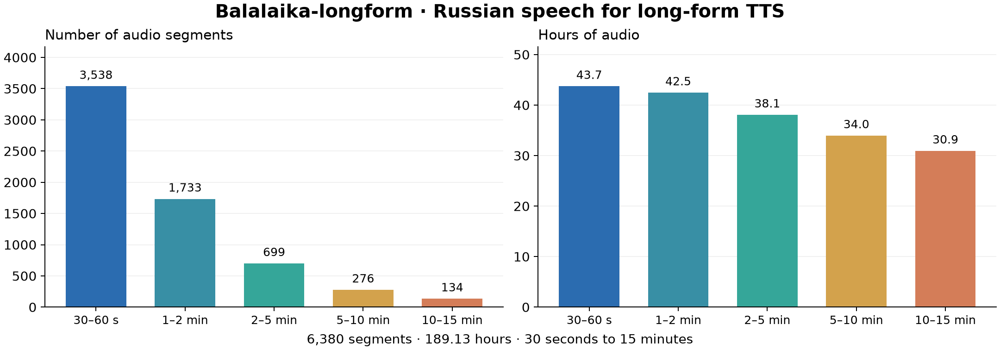

---
language:
- ru
license: other
license_name: creative-commons-attribution-source-licenses
license_link: LICENSE.md
task_categories:
- text-to-speech
pretty_name: Balalaika-longform
size_categories:
- 1K<n<10K
tags:
- audio
- speech
- russian
- tts
- long-form-tts
- webdataset
- creative-commons
configs:
- config_name: default
  default: true
  data_files:
  - split: train
    path: data/train/*.tar
  - split: validation
    path: data/validation/*.tar
  - split: test
    path: data/test/*.tar
- config_name: excluded
  data_files:
  - split: excluded
    path: data/excluded/*.tar
dataset_info:
- config_name: default
  features:
  - name: flac
    dtype: audio
  - name: txt
    dtype: string
  - name: json
    struct:
    - name: id
      dtype: string
    - name: key
      dtype: string
    - name: language
      dtype: string
    - name: text
      dtype: string
    - name: text_rover
      dtype: string
    - name: transcript_source
      dtype: string
    - name: has_text
      dtype: bool
    - name: duration_sec
      dtype: float64
    - name: segment_duration_sec
      dtype: float64
    - name: sample_rate
      dtype: int64
    - name: channels
      dtype: int64
    - name: num_frames
      dtype: int64
    - name: split
      dtype: string
    - name: paper_split
      dtype: string
    - name: exclusion_reason
      dtype: string
    - name: speaker_id
      dtype: string
    - name: source_start_sec
      dtype: float64
    - name: source_end_sec
      dtype: float64
    - name: source
      struct:
      - name: video_id
        dtype: string
      - name: url
        dtype: string
      - name: title
        dtype: string
      - name: channel
        dtype: string
      - name: channel_label
        dtype: string
      - name: youtube_channel_id
        dtype: string
      - name: channel_url
        dtype: string
      - name: channel_metadata_source
        dtype: string
      - name: license
        dtype: string
      - name: youtube_license
        dtype: string
      - name: license_version
        dtype: string
      - name: license_source
        dtype: string
      - name: license_raw
        dtype: string
      - name: license_evidence
        struct:
        - name: catalog_cc
          dtype: bool
        - name: infojson_license
          dtype: string
      - name: license_information_url
        dtype: string
    - name: audio_processing
      dtype: string
    - name: audio_sha256
      dtype: string
  - name: __key__
    dtype: string
  - name: __url__
    dtype: string
- config_name: excluded
  features:
  - name: flac
    dtype: audio
  - name: txt
    dtype: string
  - name: json
    struct:
    - name: id
      dtype: string
    - name: key
      dtype: string
    - name: language
      dtype: string
    - name: text
      dtype: string
    - name: text_rover
      dtype: string
    - name: transcript_source
      dtype: string
    - name: has_text
      dtype: bool
    - name: duration_sec
      dtype: float64
    - name: segment_duration_sec
      dtype: float64
    - name: sample_rate
      dtype: int64
    - name: channels
      dtype: int64
    - name: num_frames
      dtype: int64
    - name: split
      dtype: string
    - name: paper_split
      dtype: string
    - name: exclusion_reason
      dtype: string
    - name: speaker_id
      dtype: string
    - name: source_start_sec
      dtype: float64
    - name: source_end_sec
      dtype: float64
    - name: source
      struct:
      - name: video_id
        dtype: string
      - name: url
        dtype: string
      - name: title
        dtype: string
      - name: channel
        dtype: string
      - name: channel_label
        dtype: string
      - name: youtube_channel_id
        dtype: string
      - name: channel_url
        dtype: string
      - name: channel_metadata_source
        dtype: string
      - name: license
        dtype: string
      - name: youtube_license
        dtype: string
      - name: license_version
        dtype: string
      - name: license_source
        dtype: string
      - name: license_raw
        dtype: string
      - name: license_evidence
        struct:
        - name: catalog_cc
          dtype: bool
        - name: infojson_license
          dtype: string
      - name: license_information_url
        dtype: string
    - name: audio_processing
      dtype: string
    - name: audio_sha256
      dtype: string
  - name: __key__
    dtype: string
  - name: __url__
    dtype: string
---

# Balalaika-longform

**Russian speech for long-form text-to-speech: 189.13 hours of audio in 6,380 segments, each 30 seconds to 15 minutes long.**

Balalaika-longform is a corpus for training and evaluating **text-to-speech (TTS)** systems on sustained speech. It retains long, continuous segments with their transcripts so that models can learn beyond the short utterances common in TTS training. The recordings include audiobook readings, lectures, talks, and other spoken material from YouTube.

**All 313 source videos were marked Creative Commons Attribution (CC BY) in the collected source metadata.** Every sample carries its original video URL, title, source time interval, and licensing evidence. Source credits are also available in [metadata/sources.jsonl](metadata/sources.jsonl); see [Licensing and attribution](#licensing-and-attribution) below.

The release contains the **v3.1 enhanced audio**, losslessly packaged as WebDataset TAR shards. Each sample has a FLAC recording, a punctuated Russian transcript, and JSON metadata. Train, validation, and test follow the channel-disjoint partition used in the long-form TTS experiments.



## Dataset at a glance

| Property | Value |
|---|---|
| Language | Russian |
| Intended task | Long-form text-to-speech |
| Full corpus | 6,380 segments / 189.13 hours |
| Segment length | 30–900 seconds |
| Sources | 313 YouTube videos from 41 source channels |
| Audio | FLAC, 16-bit PCM; original sample rate and channel count preserved |
| Sample rates | 44.1 kHz or 48 kHz |
| Primary transcript | Punctuated, cased GigaAM-v3-e2e-CTC output |
| Alternative transcript | ROVER consensus, where available |
| Distribution format | WebDataset, approximately 1 GB per shard |

Audio is predominantly stereo. Downmix and resample for your model during data loading; the downloadable audio has not been re-encoded or resampled for this release. The source recordings were already compressed by YouTube, so FLAC describes the released encoding, not the original recording quality.

## Splits

| Split | Segments | Hours |
|---|---:|---:|
| `train` | 6,043 | 170.68 |
| `validation` | 120 | 8.50 |
| `test` | 193 | 9.07 |
| `excluded` — separate archival configuration | 24 | 0.88 |
| **Full corpus** | **6,380** | **189.13** |

Partitioning happens **by source channel, before creating short training windows**. A channel belongs to only one of train, validation, or test. The original `dev` partition is named `validation` on the Hub; `paper_split` retains its original name in the metadata. Channel labels are grouping identifiers, not verified speaker identities.

The default configuration contains train, validation, and test: **6,356 segments / 188.25 hours**. The `excluded` configuration preserves 24 additional segments from held-out channels that did not pass the validation/test ASR-consistency threshold. They are kept separately for completeness and must not be added to training. The full-corpus totals and duration figure include these archival samples.

## WebDataset layout

```text
data/
  train/train-00000.tar
  train/...
  validation/validation-00000.tar
  test/test-00000.tar
  excluded/excluded-00000.tar
metadata/
  sources.jsonl             # one provenance / attribution record per source video
  segments.jsonl            # lightweight sample index, splits, offsets, audio hashes
  shards.json               # exact shard paths, sample counts, sizes, checksums
  statistics.json
  release.json
assets/duration_distribution.png
SHA256SUMS
LICENSE.md
```

Each TAR shard contains successive groups of three files with a shared key:

```text
<key>.flac     # enhanced speech segment
<key>.txt      # punctuated UTF-8 Russian transcript
<key>.json     # transcript alternatives, audio metadata, split, and source attribution
```

The key is the original sample identifier prefixed with `balalaika_`, with decimal points replaced by `p` for WebDataset compatibility. The unchanged original identifier is stored as `id` in JSON.

## Loading the data

### Hugging Face Datasets

```bash
pip install "datasets[audio]" soundfile
```

```python
import io
import soundfile as sf
from datasets import Audio, load_dataset

dataset = load_dataset(
    "lab260/Balalaika-longform", name="default", split="train", streaming=True
)
# Keep the FLAC bytes; decode them with soundfile below.
dataset = dataset.cast_column("flac", Audio(decode=False))
sample = next(iter(dataset))
waveform, sample_rate = sf.read(io.BytesIO(sample["flac"]["bytes"]), always_2d=True)
text = sample["txt"]
metadata = sample["json"]
mono = waveform.mean(axis=1)
print(sample_rate, mono.shape, text[:100], metadata["source"]["url"])
```

### WebDataset

This example downloads one shard and reads its samples sequentially. Use the full list in `metadata/shards.json` for a complete training run.

```bash
pip install webdataset huggingface_hub soundfile
```

```python
import io
import json
import soundfile as sf
import webdataset as wds
from huggingface_hub import hf_hub_download

shard = hf_hub_download(
    repo_id="lab260/Balalaika-longform",
    repo_type="dataset",
    filename="data/train/train-00000.tar",
)
dataset = wds.WebDataset(shard, shardshuffle=False)
for sample in dataset:
    audio, sample_rate = sf.read(io.BytesIO(sample["flac"]), always_2d=True)
    text = sample["txt"].decode("utf-8")
    metadata = json.loads(sample["json"])
    print(audio.shape, sample_rate, text[:100], metadata["source"]["url"])
    break
```

For TTS training, use `.txt` or the identical JSON `text` field. Adapt the sample rate to your model and use duration-aware batching to handle the long recordings. If you derive short windows, keep every window in its parent's split and align its transcript to the selected audio interval.

## Metadata

| Field | Meaning |
|---|---|
| `id`, `key` | Original sample identifier and WebDataset key |
| `text` | Primary punctuated transcript; identical to `.txt` |
| `text_rover` | Alternative multi-ASR consensus transcript, where available |
| `transcript_source` | Recognizer used for the primary transcript |
| `duration_sec`, `sample_rate`, `channels`, `num_frames` | Properties read from the released FLAC |
| `segment_duration_sec` | Rounded duration in the original corpus manifest |
| `split`, `paper_split` | Release partition and original experiment partition |
| `speaker_id` | Video-local diarization identifier, scoped by channel and video |
| `source_start_sec`, `source_end_sec` | Segment boundaries on the source video timeline |
| `source` | Video URL and title, channel information, and original CC-license evidence |
| `audio_processing`, `audio_sha256` | Processing description and checksum of the released audio |

The original source metadata does not contain a resolved YouTube channel ID/name for every video. Missing values remain `null`; the catalog channel label and the direct video URL are retained. Speaker IDs are automatic diarization labels and should not be treated as globally verified identities.

## Preparation and annotation

The corpus was assembled using the [Balalaika speech-data pipeline](https://github.com/mtuciru/balalaika). Source discovery selected videos marked Creative Commons. Diarization and context-aware segmentation produced long speech segments; duration selection and deduplication retained one segmentation per source video. DeepFilterNet3 speech enhancement produced the v3.1 audio distributed here.

Transcripts are **automatic ASR annotations**, not manually corrected ground truth. The primary text preserves punctuation and capitalization. `text_rover` preserves the available recognizer-voting transcript used in the experiments. These are different ASR outputs and can differ in words as well as punctuation.

The data was selected as single-speaker material by the collection pipeline, but automatic segmentation, speaker assignment, and transcripts can contain errors. Recordings may retain background sounds, reverberation, disfluencies, or additional voices. These are natural recordings rather than uniformly controlled studio speech. No corpus-wide DistillMOS threshold was applied to this release.

## Licensing and attribution

**All source videos in this release were marked Creative Commons Attribution on YouTube in the archived metadata.** This is supported by a catalog `cc: true` flag, a saved YouTube `Creative Commons Attribution license (reuse allowed)` value, or both. These records were checked for all 313 included source videos when building the release; no conflicting or unknown license flag was accepted.

The source recordings retain their source licenses. Preserve the original video title, creator/channel attribution where available, source link, and licensing information when redistributing samples, and indicate the segmentation and speech enhancement applied here. The per-sample `source` object and [source index](metadata/sources.jsonl) provide this provenance. See [YouTube's Creative Commons documentation](https://support.google.com/youtube/answer/2797468?hl=en) and [LICENSE.md](LICENSE.md).

The archived flags identify the CC BY license family without a version number. This release therefore preserves the source declaration instead of assigning a new CC version to every recording. The uploader-provided flag is licensing evidence, not an independent rights audit of every underlying text or performance.

For attribution corrections or removal requests, open a [dataset discussion](https://huggingface.co/datasets/lab260/Balalaika-longform/discussions) and include the relevant video URL or sample ID.

## Acknowledgments

Credit belongs to the original creators and speakers linked in each sample. This corpus uses the Balalaika pipeline, GigaAM transcription models, recognizer-output voting (ROVER), and DeepFilterNet3 speech enhancement. Please cite the corpus URL and the exact dataset revision when reporting results.
